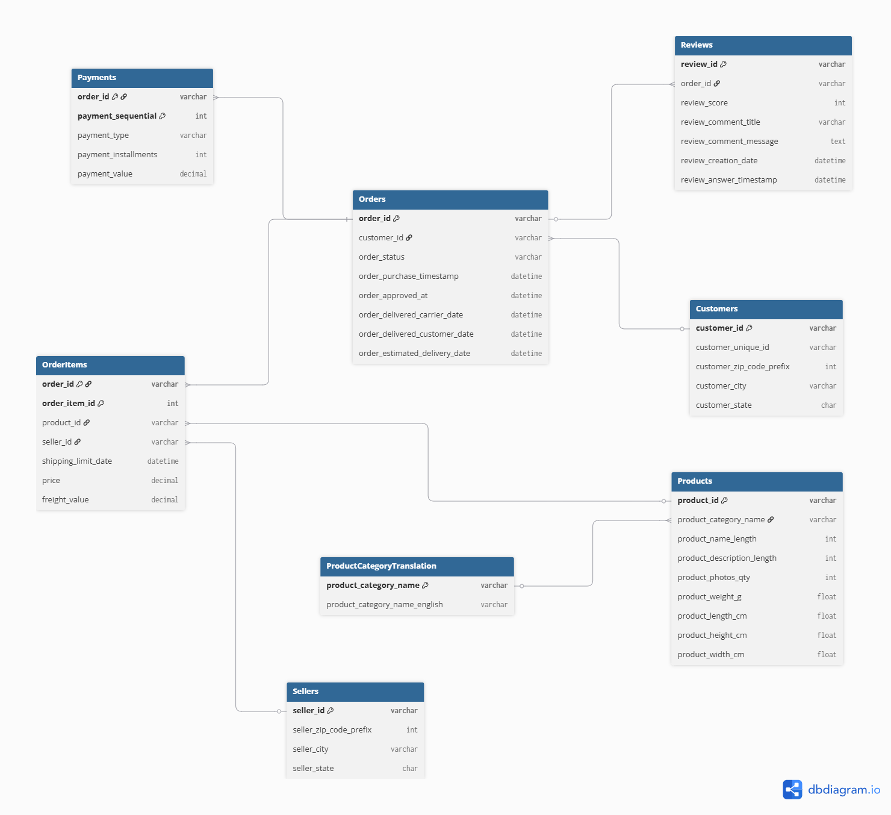

# Database Design

## Purpose

This document describes the logical database design for the **Sales Analytics Platform**.

The database is designed using the **Olist E-commerce Dataset** and follows relational database best practices. It defines the entities, relationships, primary keys, foreign keys, and normalization rules that will be implemented in Microsoft SQL Server.

---

# Entity Relationship Diagram



---

# Database Tables

The database consists of the following tables:

- Customers
- Orders
- OrderItems
- Products
- ProductCategoryTranslation
- Sellers
- Payments
- Reviews

---

# Relationships

## 1. Customers → Orders

**Relationship:** One-to-Many (1:M)

**Description**

One customer can place many orders, but each order belongs to only one customer.

**Primary Key**

```
Customers.customer_id
```

**Foreign Key**

```
Orders.customer_id
```

---

## 2. Orders → OrderItems

**Relationship:** One-to-Many (1:M)

**Description**

One order can contain multiple products. Each product purchased is stored as an individual order item.

**Primary Key**

```
Orders.order_id
```

**Foreign Key**

```
OrderItems.order_id
```

---

## 3. Products → OrderItems

**Relationship:** One-to-Many (1:M)

**Description**

A product can appear in many customer orders, while each order item references one product.

**Primary Key**

```
Products.product_id
```

**Foreign Key**

```
OrderItems.product_id
```

---

## 4. Sellers → OrderItems

**Relationship:** One-to-Many (1:M)

**Description**

One seller can sell many products. Each order item is supplied by one seller.

**Primary Key**

```
Sellers.seller_id
```

**Foreign Key**

```
OrderItems.seller_id
```

---

## 5. Orders → Payments

**Relationship:** One-to-Many (1:M)

**Description**

An order may contain multiple payment records (for example, multiple payment methods or installments).

**Primary Key**

```
Orders.order_id
```

**Foreign Key**

```
Payments.order_id
```

---

## 6. Orders → Reviews

**Relationship:** One-to-One (1:1)

**Description**

Each completed order can receive one customer review.

**Primary Key**

```
Reviews.review_id
```

**Foreign Key**

```
Reviews.order_id
```

---

## 7. ProductCategoryTranslation → Products

**Relationship:** One-to-Many (1:M)

**Description**

Each product category translation represents one category name, while many products can belong to the same category.

**Primary Key**

```
ProductCategoryTranslation.product_category_name
```

**Foreign Key**

```
Products.product_category_name
```

---

# Primary Keys

| Table | Primary Key |
|--------|-------------|
| Customers | customer_id |
| Orders | order_id |
| Products | product_id |
| Sellers | seller_id |
| Reviews | review_id |
| ProductCategoryTranslation | product_category_name |
| OrderItems | (order_id, order_item_id) |
| Payments | (order_id, payment_sequential) |

---

# Composite Primary Keys

The following tables use composite primary keys:

### OrderItems

```
(order_id, order_item_id)
```

Reason:

Each order may contain multiple products. The combination of **order_id** and **order_item_id** uniquely identifies each purchased item.

---

### Payments

```
(order_id, payment_sequential)
```

Reason:

An order may have multiple payment records. The combination of **order_id** and **payment_sequential** uniquely identifies each payment transaction.

---

# Normalization

The database follows **Third Normal Form (3NF)**.

The design ensures that:

- Every table has a unique primary key.
- Foreign keys enforce referential integrity.
- Lookup information is stored separately from transactional data.
- Data redundancy is minimized.
- Duplicate information is avoided through normalization.

---

# Design Decisions

- Product categories are stored separately using the **ProductCategoryTranslation** lookup table.
- OrderItems is used to resolve the many-to-many relationship between Orders and Products.
- Composite primary keys are used where no single column uniquely identifies a record.
- Geolocation data is intentionally excluded from the transactional (OLTP) database because the ZIP code prefix is not unique. It will be used later for analytical reporting and mapping in Power BI.


